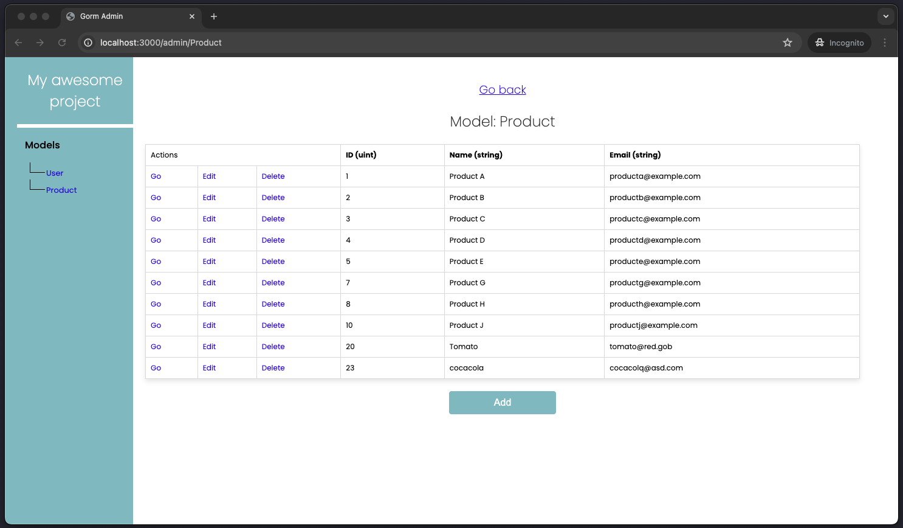

# Add an admin page to your web application!

Gorm-admin is a Go package that adds an admin page to your web application. It works with GORM as the ORM and is compatible with Fiber, Gin, and HTTP. The package uses reflection to integrate ORM functionalities across different frameworks and a virtual filesystem to store all admin pages

Feel free to contribute and improve the code! :)

## Installation:
```
go get github.com/pelusa-v/gorm-admin
```

## Usage:
```go
package main

import (
    "github.com/gofiber/fiber/v2"
    "github.com/pelusa-v/gorm-admin/src/pkg/admin"
    "gorm.io/gorm"
)

func main() {
    app := fiber.New()
    db := NewDbInstance() // *gorm.DB

    // Add admin to web application
    // use NewGinAdmin() for Gin, NewAdmin() for built-in http
    admin := admin.NewFiberAdmin(app, db)
    admin.Register()
    admin.Configure("My awesome project")

    // Register your models to admin page
    admin.RegisterModel(User{})
    admin.RegisterModel(Product{})
    
    app.Listen(":3000")
}

type User struct {
    gorm.Model
    Name  string
    Email string
}

type Product struct {
    ID    uint
    Name  string
    Email string
}

```

> [!IMPORTANT]
> You need to migrate your models to DB

## Admin:
When you run your web application, navigate to `/admin` to see a page like this:

You can now perform CRUD operations on your models from the admin page!

## Contributing:
Contributions are welcome! Please open an issue or submit a pull request with your changes.